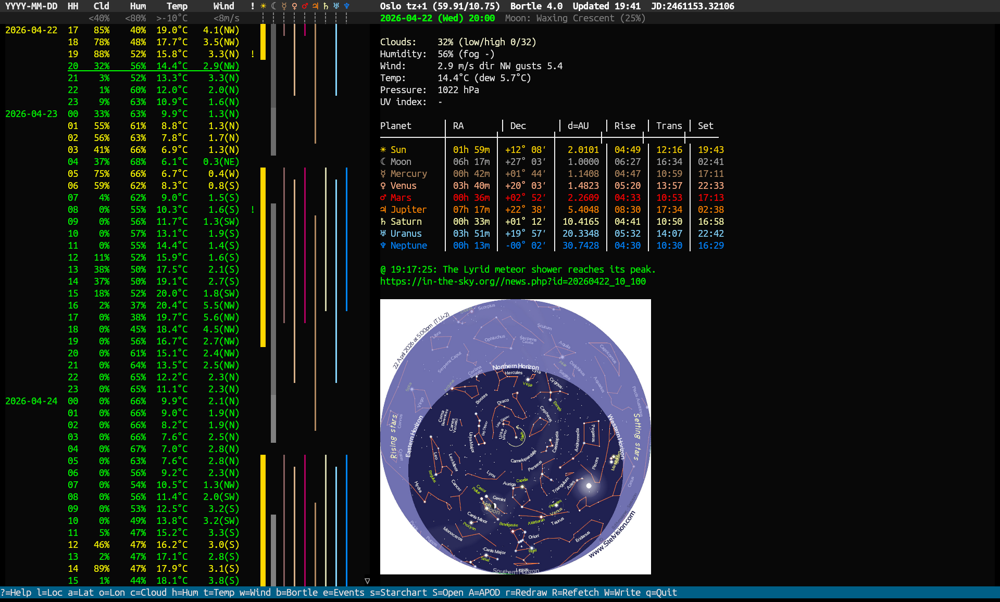

# Nova - Terminal Astronomy Panel



   

Terminal panel for amateur astronomers. Weather forecast, ephemeris, astronomical events, starchart, and NASA APOD in one TUI. Decides whether it is worth taking the telescope out tonight.

Rust feature port of [astropanel](https://github.com/isene/astropanel), built on [crust](https://github.com/isene/crust). Shares the ephemeris engine with [tock](https://github.com/isene/tock).

<br clear="left"/>

## Screenshot



*Real-time astronomy panel: ephemeris, weather, starchart, and inline APOD.*

## Quick Start

```bash
# Download from releases (Linux/macOS, x86_64/aarch64)
# Or build from source:
git clone https://github.com/isene/nova
cd nova
cargo build --release

# Run (first launch prompts for location)
./target/release/nova
```

Press `?` inside the app for the full keybinding reference.

## Features

- **9-day weather forecast** from [met.no](https://api.met.no/) with hourly detail, cached 3 hours
- **Condition scoring** (green/yellow/red) per your cloud/humidity/temperature/wind limits
- **Visibility bars** for Sun, Moon, and planets, one bar per hour, one column per body
- **Moon phase** shown as a graded gray intensity (new = dark, full = bright) on the Moon bar
- **Ephemeris table** (RA, Dec, distance, rise, transit, set) for all 9 bodies, IAU 2006 standard
- **Astronomical events** from [in-the-sky.org](https://in-the-sky.org) RSS, shown in-line with the hour bracket
- **Starchart** from Stelvision for the selected hour (cached per slot)
- **Astronomy Picture of the Day** (NASA APOD) cached per day
- **Inline image display** via kitty/sixel/w3m protocols using [glow](https://github.com/isene/glow)
- **Julian Date** in the header
- **Bortle scale** field for site quality tracking
- **Async fetches** — background threads load events and images without blocking the UI

## Keys

| Key | Action |
|---|---|
| `?` | Help |
| `UP` / `DOWN` | Move row |
| `PgUP` / `PgDOWN` | Page |
| `HOME` / `END` | First / last row |
| `ENTER` | Refresh / redraw current image |
| `r` | Redraw all panes |
| `R` | Refetch weather + events |
| `l` | Location name |
| `a` | Latitude |
| `o` | Longitude |
| `c` | Cloud limit % |
| `h` | Humidity limit % |
| `t` | Temp lower limit °C |
| `w` | Wind limit m/s |
| `b` | Bortle scale (1-9) |
| `e` | Show all upcoming events |
| `s` | Starchart for selected hour |
| `S` | Open starchart in system image viewer |
| `A` | Astronomy Picture of the Day |
| `W` | Save config |
| `q` | Quit |

## Configuration

`~/.nova/config.yml` (auto-created on first run; first-launch prompts for location):

```yaml
location: Oslo
tz_name: Europe/Oslo
lat: 59.91
lon: 10.75
tz: 1.0
cloud_limit: 40
humidity_limit: 80.0
temp_limit: -10.0
wind_limit: 8.0
bortle: 4.0
show_planets: true
show_events: true
```

- `location`: Display name shown in the header.
- `tz_name`: IANA timezone used for the in-the-sky.org events feed (Cont/City format).
- `lat` / `lon`: Observer position in degrees.
- `tz`: UTC offset in hours (e.g. `1.0` for CET, `-5.0` for EST).
- `cloud_limit`, `humidity_limit`, `temp_limit`, `wind_limit`: Thresholds for condition coloring.
- `bortle`: Light-pollution class for your site (1 = darkest, 9 = inner-city).

Weather cache: `~/.nova/weather_cache.json` (TTL 3 hours).
Image cache: `~/.nova/images/` (APOD per day, starchart per slot; cleaned to ~50 entries).

## Condition Rules

Each hour gets "negative points" based on your limits:

- 2 points if cloud cover > cloud_limit
- +1 point if cloud cover > (100 - cloud_limit)/2
- +1 point if cloud cover > 90%
- +1 point if humidity > humidity_limit
- +1 point if temperature < temp_limit
- +1 point if temperature < temp_limit - 7°C
- +1 point if wind > wind_limit
- +1 point if wind > 2 × wind_limit

**0-1 = GOOD (green), 2-3 = FAIR (yellow), 4+ = BAD (red).**

## Data Sources

- **Weather**: [api.met.no](https://api.met.no/) (Norwegian Meteorological Institute)
- **Events**: [in-the-sky.org](https://in-the-sky.org/rss.php) RSS feed
- **Starchart**: [stelvision.com](https://www.stelvision.com/carte-ciel/)
- **APOD**: [apod.nasa.gov](https://apod.nasa.gov/)
- **Ephemeris**: Port of [ruby-ephemeris](https://github.com/isene/ephemeris), IAU 2006 obliquity standard

## Part of the Rust Terminal Suite (Fe2O3)

See the [Fe₂O₃ suite overview](https://github.com/isene/fe2o3) and the [landing page](https://isene.org/fe2o3/) for the full list of projects.

- [rush](https://github.com/isene/rush) — shell
- [pointer](https://github.com/isene/pointer) — file manager
- [kastrup](https://github.com/isene/kastrup) — messaging hub
- [scroll](https://github.com/isene/scroll) — web browser
- [tock](https://github.com/isene/tock) — calendar
- **nova** — astronomy panel

## License

Unlicense (public domain).
